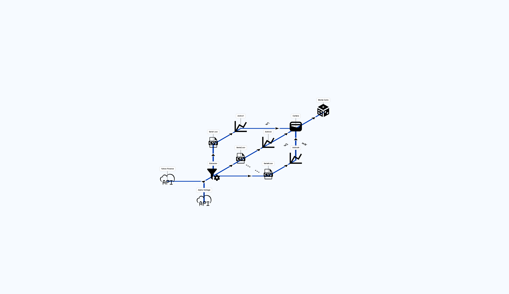

# Tarea_Bloque1_MIAX
Resolución de la tarea del bloque 1 del máster MIAX. Su contenido es el siguiente:
# src 
Contiene todos los archivos .py:
- cartera.py: Este archivo contiene la definición de la clase Cartera, que representa una cartera compuesta por acciones de empresas e/o índices. Contiene métodos para realización de simulaciones de Monte Carlo, generación de informes y de gráficas.
- data_utils.py: Este archivo contiene la definición de varios métodos auxiliares que llevan a cabo tareas recurrentes.
- extractor.py: Programa encargado de la extracción de datos desde el API demandada por el usario, de su transformación y de su presentación final en formato csv y json.
- monteCarlo.py: Programa que permite realizar un número, especificado por el usuario, de simulaciones de Monte Carlo de una cartera en su conjunto o de cada una de sus componentes. Las simulaciones pueden ser moldeadas por el usuario, mediante parámetros como el valor de la cartera, las medias y desviaciones típicas de las componentes o el número de días de cada simulación.
- seriePrecios.py: Este archivo contiene la definición de la clase SeriePrecios, que representa una serie temporal de precios OHLC de acciones de una empresa o de un índice. También calcula varios estadísticos derivados de dichos precios.

La siguiente imagen representa el flujo de trabajo del proyecto, y como los programas y clases interaccionan entre sí:

# Utilización
Las acciones disponibles para consultar van a ser las de las empresas: Apple, Microsoft, Alphabet, Amazon, Nvidia, JPMorgan, Goldman Sachs, Coca-Cola, McDonald's, Tesla, ExxonMobil, Johnson & Johnson, Pfizer. Por otro lado, los índices serán: S & P 500, Nasdaq, Dow Jones, Euro Stoxx, Nikkei, IBEX 35. Las APIs disponible son: yfinance. El modo de ejecución es el siguiente:

python main.py --accion [Accion] --indice [Indice] --api [API] --fechaInicio [fechaInicio] --fechaFinal [fechaFinal]. 
Ejemplos de uso serían python main.py --accion Apple --api yfinance --fechaInicio 23-12-2001 --fechaFinal 23-12-2002 o python main.py --indice Nasdaq --api yfinance --fechaInicio 23-12-2001 --fechaFinal 23-12-2002. Importante, en el caso de nombres con el carácter & o con espacios, pasarlos entrecomillados, python main.py --accion "Johnson & Johnson" --api yfinance --fechaInicio 23-12-2001 --fechaFinal 23-12-2002.       

